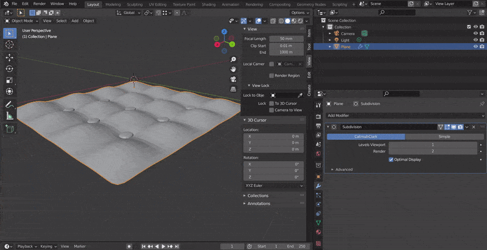
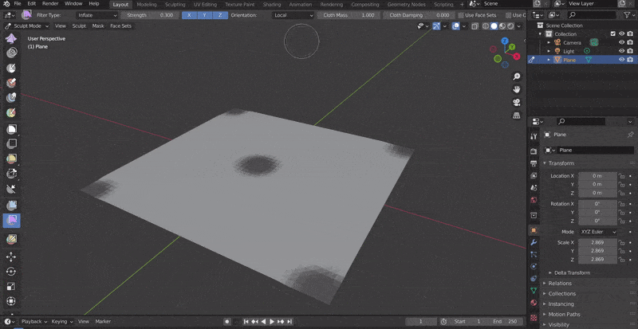
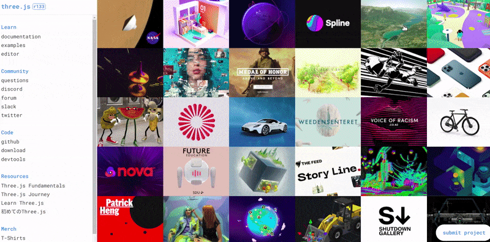
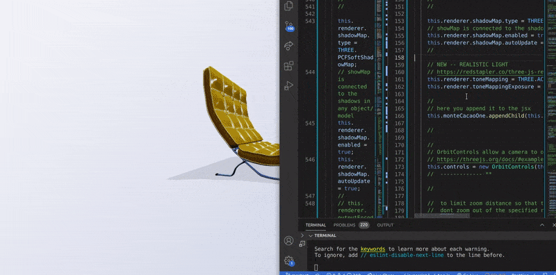

#### I modeled this chair based on the celebre Barcelona chair designed by Ludwig Mies van der Rohe and Lilly Reich, for the German Pavilion at the International Exposition of 1929

> The model is similar but not the same (to prevent copyright issues)

<br>

# the project

> It was divided in 3 parts:

- Blender 5 months (to learn from scratch)
- Threejs | javascript (2 weeks)
- web development | javascript | react (1 month)

<br>

#### In total it took me 6 to 7 months to design all the furniture in the scenes, including the different houses (i created before choosing the one i picked for this project), i also had to do a lot of research about the lighting (eevee | cycles ) in Blender and then THREEJS (which you will find at the end of this file). I had to learn about textures, materials, shaders, particles, physics (for the carpet, curtains and other stuff i decide not to use) animation, sound and of course dive more into web design & front end development.

<br>

[]()

<br>
 
<br>

- From the beginning i knew that i would have to build the model thinking in when i would have to export it to threejs so I tried to follow the rules (keeping it clean) and also building it in parts in case there was an issue, I addition to that i also added [seams ](https://www.oreilly.com/library/view/learning-blender-a/9780133886283/ch08lev2sec6.html) to each part so to have a nice situation with the UV'S (**i thought i did it well** 😆 ), but i didnt realize the baking issues until the end when i had to finally use it. (but at the end it worked out).

<br>

#### [How to add seams](https://youtu.be/cS6B5PAzlWI)

#### [UV Unwrapping - Blender 2.80 Fundamentals](https://youtu.be/Y7M-B6xnaEM)

<br>

#### The way i started the chair was using this method:

[]()

> This wans't complicated at all as i just had to do it like in the image, then extrude and give it the squared shape, then use a lattice to curve it a bit, but before that i had to wait until i had finished the chair support (the steel part).

#### I was considering this other option:

> But after realizing [how many vertices ](https://docs.unity3d.com/560/Documentation/Manual/OptimizingGraphicsPerformance.html) (+ **400.000** due to the duplication of the square) it took to have the same result, i decided to use the first option:

[]()

<br>
<br>
<br>

# Beginning

### issue #1: the textures in threejs

[How to make texture size correctly in THREE.js?](https://gamedev.stackexchange.com/questions/123698/how-to-make-texture-size-correctly-in-three-js)

> I had to do it fast since i didn't have more than 2 days to give to this project, and the reason for that was because parallel to this i was building a website(in which i wanted the chair to be integrated). So since i didn't have photoshop i had to look for other solutions with other free but complicated softwares(which made the situations even terrible), so i created a pattern manually which took me an hour to do it perfectly.

##### In Blender the crocodile texture is composed of 4 images:

- color
- roughness
- normal
- displacement

### The first time, i tried to export the model with the 4 textures (so naive)

- All these 4 images "makes the crocodile texture of the chair", together they make around 90mb even (compressed with draco and also saved for web) ,so i exported the model to threejs without any textures| materials (no images or NODES), and it went from 96mb to 207.5 kb

<br>

> **How to Bake Textures in Blender and Export to Unity** [How to Bake Textures in Blender and Export to Unity
> ](https://stackoverflow.com/questions/52614371/apply-color-gradient-to-material-on-mesh-three-js)

<br>

### Then i decided to bake the 4 images 🥥

##### So After the baking concluded, i got a blue message "baking map saved to internal image, save it externally or pack it”

- I made some research, to figure out the issue:

https://blender.stackexchange.com/questions/186467/why-do-i-get-this-message-baking-map-saved-to-internal-image-save-it-externall

> Your main problem is elsewhere.

> You need to check Selected to Active if you're baking from a hi-res mesh.
> Otherwise you'll get an empty normal map.

> Select your Hi-Res mesh
> Select your target mesh with the image texture
> Check Selected to Active and hit Bake.

#### APPARENTLY THE SOLUTION DONT WORK FOR A SINGLE OBJECT:

https://blenderartists.org/t/cycles-bake-no-valid-objects-selected/613376/9

> This problem occurs whenever you try to bake your object with the “Selected to active” ticked ON. This option is used if you have multiple objects selected and want to bake all of them at once.
> Remember in that case also to mark the texture nodes you want baked to in every obejcts’ material.

#### MORE

##### when adding the 2024px w and height i checked [x] the ALPHA, that was the only thing i made different and it didnt gave me an error but instead drop me an image

#### ALSO:

you have to select the furniture you are exporting and the nodes it uses

#### SOLUTION TO THE CROCODILE TEXTURE NOT MATCHING

> I HAD TO MAKE SEAMS TO THE CUCHION THEN SMART UNWRAP AGAIN, THEN EXPORT IT AGAIN, AS ANY CHANGE IN THE BLENDER MODEL SHOULD
> BE UPDATED AND THEN EXPORTED TO THREEJS, OTHERWISE YOU WONT SEE ANY CHANGE.

##### SO AFTER THAT THE BAKED IMAGE WORKED

<br>

#### In the picture below you can see the differences of the texture in Blender and the texture in Threejs

> <u>I tested different bakings to see the results as it was my first time baking textures</u> , at the end i obtained a crocodile texture out of the 4 images and then i populated a file in something similar to photoshop to get a pattern. (I know there are complicated ways to do it with code but i didn't have time to try it)

#### to try in the future:

[Three.js: How do I scaling and offset my image textures?](https://stackoverflow.com/questions/33803280/three-js-how-do-i-scaling-and-offset-my-image-textures)

```javascript
/*
.repeat - How many times the texture is repeated across the surface, in each direction U and V.

.offset - How much a single repetition of the texture is offset from the beginning, in each direction U and V. Typical range is 0.0 to 1.0.

.wrapS - The default is THREE.ClampToEdgeWrapping, where the edge is clamped to the outer edge texels. The other two choices are THREE.RepeatWrapping and THREE.MirroredRepeatWrapping.

.wrapT - The default is THREE.ClampToEdgeWrapping, where the edge is clamped to the outer edge texels. The other two choices are THREE.RepeatWrapping and THREE.MirroredRepeatWrapping.

NOTE: tiling of images in textures only functions if image dimensions are powers of two (2, 4, 8, 16, 32, 64, 128, 256, 512, 1024, 2048, ...) in terms of pixels. Individual dimensions need not be equal, but each must be a power of two. This is a limitation of WebGL, not Three.js.

Example of scale:

 


*/
// scale x2 horizontal
texture.repeat.set(0.5, 1);
// scale x2 vertical
texture.repeat.set(1, 0.5);
// scale x2 proportional
texture.repeat.set(0.5, 0.5);
```

#### or

[Scaling texture to fit a (any size) Plane perfectly](https://stackoverflow.com/questions/50842740/three-js-scaling-texture-to-fit-a-any-size-plane-perfectly/50889010)

> **Miscellaneous:** Apply color gradient to material on mesh - three.js

[https://stackoverflow.com/questions/52614371/apply-color-gradient-to-material-on-mesh-three-js](https://stackoverflow.com/questions/52614371/apply-color-gradient-to-material-on-mesh-three-js)

<br>

> It was all a question of **Aesthetic**, i liked more the small details than the bigger ones...

[]()

### More baking issues (steel effect)

> it wasnt baking the metal texture because the metalic part wasnt SMART unwrapped, after i did it, it started baking.

- Once i got the baking, i realized it wasnt going to work in threejs in the way i had it in blender, and that because of the reflectivity which is different there.

So after searching for a solution i found out that it had to be made like this:

- You need images (hdri) to play with the reflection
- you need to create a cube that will wrap the mesh like a 'world' simulation.

<br>

https://threejs.org/examples/?q=env#webgl_materials_envmaps

[Equirectangular map by university of southern california](https://github.com/mrdoob/three.js/blob/master/examples/webgl_materials_envmaps.html)

[]()

## Reflections

#### [Dynamic reflections in Three.js](https://stackoverflow.com/questions/34590256/dynamic-reflections-in-three-js)

#### ➡️ [Three.js Realistic Material Reflection Tutorial](https://redstapler.co/three-js-realistic-material-reflection-tutorial/)

<br>

#### Realistic color management | sRGBEncoding with post-processing

##### [sRGBEncoding with post-processing](https://discourse.threejs.org/t/srgbencoding-with-post-processing/12582)

> I will add the blog post here in case they decide to delete it like i have seen so often!

```javascript


/*
I was reading this article https://gist.github.com/donmccurdy/fefb35c5ba033e7dcd641f9684e47a82

which recommends our projects use renderer.outputEncoding = THREE.sRGBEncoding; for realistic color management. Everything was looking great, until I started adding the Bloom post-processing 3 effect and FXAA via the effect composer.

Bloom with threshold = 1 should have no effect, yet it makes the scene.background color brighter.
FXAA makes everything really dark.

The article I linked to explains this behavior:

Renderer should have .outputEncoding = sRGBEncoding if no post-processing is used, otherwise use LinearEncoding and apply gamma correction (TBD) as last pass in post instead.

I used LinearEncoding, but everything looks dark & saturated now. So my question is, how do I enable this encoding in the post-processing pass? I see a function in both Unreal and FXAA shaders:


*/

vec4 LinearTosRGB( in vec4 value ) {
    return vec4( mix( pow( value.rgb, vec3( 0.41666 ) ) * 1.055 - vec3( 0.055 ), value.rgb * 12.92, vec3( lessThanEqual( value.rgb, vec3( 0.0031308 ) ) ) ), value.a );
}

/*
It’s not so clear in the docs but you can use the GammaCorrectionShader 46 like so:
*/
const gammaCorrectionPass = new ShaderPass( GammaCorrectionShader );
composer.addPass( gammaCorrectionPass );
/*
Keep in mind it’s not exactly like outputEncoding = sRGBEncoding, though, because Fog and Scene.background need to be manually converted to linear color space otherwise they’ll look incorrect.

*/
```

```javascript
import * as THREE from "three";
import { GLTFLoader } from "three/examples/jsm/loaders/GLTFLoader";
import { DRACOLoader } from "three/examples/jsm/loaders/DRACOLoader";
import { RoomEnvironment } from "three/examples/jsm/environments/RoomEnvironment.js";
// https://threejsfundamentals.org/threejs/lessons/threejs-lights.html
import { RectAreaLightHelper } from "three/examples/jsm/helpers/RectAreaLightHelper.js";
import { RectAreaLightUniformsLib } from "three/examples/jsm/lights/RectAreaLightUniformsLib.js";

/*


*/
// -------------------------------------------
//  STUDIO ENV MAP  ** it works
let textureEquirec;
// https://github.com/mrdoob/three.js/blob/master/examples/webgl_materials_envmaps.html
// this.envMap = this.loaderImg.load("./envMap/studio_envMap.jpg");
// this.envMap.mapping = THREE.SphericalReflectionMapping();
// material.envMap = envMap;
this.loaderImgCube = new THREE.CubeTextureLoader();
this.loaderImgCube.setPath("./img/bridge_cube_img/");

this.textiCubeEnvBridge = this.loaderImgCube.load([
  "posx.jpg",
  "negx.jpg",
  "posy.jpg",
  "negy.jpg",
  "posz.jpg",
  "negz.jpg",
]);

this.textiCubeEnvBridge.encoding = THREE.sRGBEncoding;

/*


*/

const textureLoader = new THREE.TextureLoader();
textureEquirec = textureLoader.load("./img/photo_studio_01_4k.hdr");
textureEquirec.mapping = THREE.EquirectangularReflectionMapping;
textureEquirec.encoding = THREE.sRGBEncoding;
//
// environment
// PMREMGenerator: Prefilteres, Midmapped Radiance Environment Map
const pmremGenerator = new THREE.PMREMGenerator(this.renderer);
pmremGenerator.compileEquirectangularShader();
// SCENE BACKGROUND ///)))))))---------------------***
// https://stackoverflow.com/questions/61712628/threejs-how-to-add-hdri-equirectangle-map-for-lighting-the-scene-while-keepi
// this.scene.background = new THREE.Color(0xFEF5E9);
// this.scene.background = this.textiCubeEnvBridge;
// this.scene.environment = this.textiCubeEnvBridge;
//
this.scene.environment = pmremGenerator.fromScene(
  new RoomEnvironment(),
  0.02
).textureEquirec;
// //

/*


*/

// STEEL BRIDGE REFLECTION
this.SteelBridgeMat = new THREE.MeshLambertMaterial({
  envMap: this.textiCubeEnvBridge,
  color: 0xeeeeee,
});
// STEEL BRIDGE RUBBER BLACK
this.SteelBlackBridgeMat = new THREE.MeshLambertMaterial({
  envMap: this.textiCubeEnvBridge,
  // DONT ADD 000000 as its too dark and will not shine,
  // instead add a lower shade of black
  color: 0x0c0c0c,
});
```

#### The way I applied it

```javascript
//
//              ---------------------   *
//                     CHAIR
//           *  ---------------------
//

gltfLoader.load("./models_furniture/barcelonaChair_good2.glb", (gltf) => {
  gltf.scene.traverse((itemsBarcelonaChair) => {
    this.meshToPlayWithAnimation = gltf.scene;

    //
    //       //
    if (itemsBarcelonaChair.name === "cushion_bort") {
      itemsBarcelonaChair.material = this.crocoMatPhysical;
      itemsBarcelonaChair.position.y = 0.1;
    }
    //
    if (itemsBarcelonaChair.name === "cushionbort2") {
      itemsBarcelonaChair.material = this.crocoMatPhysical;
      itemsBarcelonaChair.position.y = 0.1;
    }
    //
    if (itemsBarcelonaChair.name === "steel_chair") {
      itemsBarcelonaChair.material = this.SteelBridgeMat;
      itemsBarcelonaChair.position.y = 0.1;
    }
    //--------------------------
    //
    if (itemsBarcelonaChair.name === "blackRubberFeetChair_left_bottom") {
      itemsBarcelonaChair.material = this.SteelBlackBridgeMat;
      itemsBarcelonaChair.position.y = 0.1;
    }
    if (itemsBarcelonaChair.name === "blackRubberFeetChair_right_bottom") {
      itemsBarcelonaChair.material = this.SteelBlackBridgeMat;
      itemsBarcelonaChair.position.y = 0.1;
    }
    if (itemsBarcelonaChair.name === "blackRubberFeetChair_left_bottom_back") {
      itemsBarcelonaChair.material = this.SteelBlackBridgeMat;
      itemsBarcelonaChair.position.y = 0.1;
    }
    if (itemsBarcelonaChair.name === "blackRubberFeetChair_right_bottom_back") {
      itemsBarcelonaChair.material = this.SteelBlackBridgeMat;
      itemsBarcelonaChair.position.y = 0.1;
    }
    // --------------------------------
    //
    //
    if (itemsBarcelonaChair.name === "rubberFrontLeft") {
      itemsBarcelonaChair.material = this.SteelBlackBridgeMat;
      itemsBarcelonaChair.position.y = 0.1;
    }
    if (itemsBarcelonaChair.name === "rubberFrontRight") {
      itemsBarcelonaChair.material = this.SteelBlackBridgeMat;
      itemsBarcelonaChair.position.y = 0.1;
    }
    if (itemsBarcelonaChair.name === "rubberLeftBack") {
      itemsBarcelonaChair.material = this.SteelBlackBridgeMat;
      itemsBarcelonaChair.position.y = 0.1;
    }
    if (itemsBarcelonaChair.name === "rubberRightBack") {
      itemsBarcelonaChair.material = this.SteelBlackBridgeMat;
      itemsBarcelonaChair.position.y = 0.1;
    }
    //       //
    itemsBarcelonaChair.castShadow = true;
    // itemsBarcelonaChair.receiveShadow = true;

    //----------------------------**
    // console.log(sleepingSnakeRock);
  });

  this.scene.add(gltf.scene);
});
//
//              ---------------------   *
//                     CHAIR
//           *  ---------------------
//
```

<br>
<hr>
<br>

## The Backgrounds and Skyboxes

[Three.js Backgrounds and Skyboxes](https://threejsfundamentals.org/threejs/lessons/threejs-backgrounds.html)

#### CAREFUL where you position the _this.renderer.setClearColor_ , as if you put it above the renderer it will probably give you an error

```javascript
// ---------------------------------------
//                  RENDERER
// ---------------------------------------
//
this.renderer = new THREE.WebGL1Renderer({
  antialias: true, // will make the edges smooth
  // set the transparency of the scene, otherwise its black
  alpha: true,
});
//
//
//
this.renderer.setClearColor(0x000000, 0);
//
```

#### [Three.js: How to add envMap correctly?](https://stackoverflow.com/questions/65974012/three-js-how-to-add-envmap-correctly)

#### How three.js uses the gradient color for the background

https://stackoverflow.com/questions/50226091/how-three-js-uses-the-gradient-color-for-the-background

##### For advanced effects, try using

https://github.com/mattdesl/three-vignette-background

or see how it works. For something simple, make a CSS gradient and put it behind the canvas. You can use CSS to make the gradient and then make the threejs canvas transparent.

<br>

#### Transparent background with three.js

https://stackoverflow.com/questions/20495302/transparent-background-with-three-js

<br>

#### How to hide the display of background HDR map, but save hdri's work for lighting in three.js?

[How to hide the display of background HDR map, but save hdri's work for lighting in three.js?](https://stackoverflow.com/questions/56092514/how-to-hide-the-display-of-background-hdr-map-but-save-hdris-work-for-lighting)

<br>

#### How to show a cube map reflection on a object without showing the cubemap in the background?

[How to show a cube map reflection on a object without showing the cubemap in the background?](https://stackoverflow.com/questions/32167275/how-to-show-a-cube-map-reflection-on-a-object-without-showing-the-cubemap-in-the)

```javascript
var path = "textures/cube/foo/";
var format = ".png";

var urls = [
  path + "px" + format,
  path + "nx" + format,
  path + "py" + format,
  path + "ny" + format,
  path + "pz" + format,
  path + "nz" + format,
];

var envMap = THREE.ImageUtils.loadTextureCube(
  urls,
  THREE.CubeReflectionMapping,
  callback
); // callback function is optional

var material = new THREE.MeshPhongMaterial({
  color: 0x999999,
  specular: 0x050505,
  shininess: 50,
  envMap: envMap,
  combine: THREE.MixOperation, // or THREE.AddOperation, THREE.MultiplyOperation
  reflectivity: 0.5,
});
```

<br>

#### [How to get my scene background to be transparent?](https://discourse.threejs.org/t/how-to-get-my-scene-background-to-be-transparent/11702)

#### [Gradient example](https://jsfiddle.net/f2Lommf5/15331/)

> I have a gradient in the styles but all happens here:

```javascript
this.renderer.setClearColor(0x000000, 0);

// scss

/*
  .wrapper-all {
    height: 100vh;
    // gradients
    background-image: linear-gradient(135deg, #f5f7fa 0%, #c3cfe2 100%);
    display: flex;
    align-items: center;
    justify-content: center;
    //
    .scene-monteCacaoOne {
      width: 100%;
      height: 80vh;
      max-width: 1000px;
      overflow: hidden;
      display: flex;
      align-items: center;
      justify-content: center;

      .monteCacaoOne {
        width: 100%;
        height: 100%;
        margin: 0;
        text-align: center;
        max-width: 1000px;
        overflow: hidden;
      }
    }
  }

*/
```

<br>
<br>
<hr>
<br>
<br>

# Adding the Lights

#### but before:

> I must to admit there was a bit of confusion in certain topics

- renderer.gammaInput = true;
- renderer.gammaOutput = true;

> To achieve that nice glossiness we have to use a **THREE.MeshStandardMaterial**, the new physically accurate material in Three.js.

```javascript
var material = new THREE.MeshStandardMaterial({color: “#000”, roughness: 0});
```

#### [Glossy spheres in Three.js](https://pierfrancesco-soffritti.medium.com/glossy-spheres-in-three-js-bfd2785d4857)

### toneMappingExposure

> this value **affects the brightness of MeshBasicMaterials where normal lights don’t**.

> Tone mapping is a technique used in image processing and computer graphics to map one set of colors to another to approximate the appearance of high-dynamic-range images in a medium that has a more limited dynamic range. Print-outs, CRT or LCD monitors, and projectors all have a limited dynamic range that is inadequate to reproduce the full range of light intensities present in natural scenes. Tone mapping addresses the problem of strong contrast reduction from the scene radiance to the displayable range while preserving the image details and color appearance important to appreciate the original scene content.

```javascript
//
//
this.renderer.setClearColor(0x000000, 0);
//
this.renderer.setSize(width, height);
// BG color from the scene

//
//
//

this.renderer.shadowMap.type = THREE.PCFSoftShadowMap;
// showMap is connected to the shadows in any object/model
this.renderer.shadowMap.enabled = true;
this.renderer.shadowMap.autoUpdate = true;
//
// this.renderer.outputEncoding = THREE.sRGBEncoding;
// this.renderer.gammaFactor = 2.5;
// the following 2 lines will reduce the blueish on the steel
this.renderer.gammaOutput = true;
// this.renderer.gammaInput = true;

// NEW -- REALISTIC LIGHT
this.renderer.toneMapping = THREE.ReinhardToneMapping;
// this.renderer.toneMapping = THREE.ACESFilmicToneMapping;
this.renderer.toneMappingExposure = 1; //0.1 will show it darker, 2 is exremely hight

//
// here you append it to the jsx
this.monteCacaoOne.appendChild(this.renderer.domElement); // mount using React ref

//

//
// OrbitControls allow a camera to orbit around the object
// https://threejs.org/docs/#examples/controls/OrbitControls
this.controls = new OrbitControls(this.camera, this.monteCacaoOne);
//  ------------- **
```

### .toneMappingExposure

[Is there a way to increase scene environment map exposure without affecting unlit materials?](https://discourse.threejs.org/t/is-there-a-way-to-increase-scene-environment-map-exposure-without-affecting-unlit-materials/13458)

[]()

#### THREE.ACESFilmicToneMapping

> - ACES Filmic tone mapping leads to a hue shift.
> - Tone mapping is intended for HDR to LDR conversion

[ACESFilmicToneMapping leading to low-contrast textures](https://discourse.threejs.org/t/acesfilmictonemapping-leading-to-low-contrast-textures/15484)

[Material using plain colours getting burnt when using THREE.ACESFilmicToneMapping](https://stackoverflow.com/questions/63267940/material-using-plain-colours-getting-burnt-when-using-three-acesfilmictonemappin)

[]()

```javascript
//-------------------------------------
//                        NEW TEST
//   SecondHemLight
//------------------
// https://www.youtube.com/watch?v=T6PhV4Hz0u4&list=PLIQopnnM5nVaHWcPUWL6wPrQvBUTQZK1X&index=22
// https://threejs.org/docs/#api/en/lights/RectAreaLight
// https://threejsfundamentals.org/threejs/lessons/threejs-lights.html
//https://discourse.threejs.org/t/degree-or-radian/21227/2

//
```

```javascript
import { RectAreaLightHelper } from "three/examples/jsm/helpers/RectAreaLightHelper.js";
import { RectAreaLightUniformsLib } from "three/examples/jsm/lights/RectAreaLightUniformsLib.js";

//
//
// THIS LIGHT IS SIMILAR TO THE BLENDER ONE, the one that can be long
this.widthLightRectArea = 20;
this.heightLightRectArea = 10;

// RectAreaLightUniformsLib.init();  this one goes at the very top of the page, where you dispose the textures, so that it dont kill the computer :)
//
// THREE.RectAreaLightUniformsLib.init();
this.lightRectArea = new THREE.RectAreaLight(
  0xffffff,
  4,
  this.widthLightRectArea,
  this.heightLightRectArea
);

this.lightRectArea.position.set(0, 10, 0);
this.lightRectArea.rotation.x = THREE.MathUtils.degToRad(-32);
this.lightRectArea.lookAt(0, 0, 0);
//
this.scene.add(this.lightRectArea);
// const helper = new RectAreaLightHelper(this.lightRectArea);
// this.lightRectArea.add(helper);
// -------------------------------------
```

#### the sun

```javascript
// //                       THE SUN
// // its the distance that gives the shadow
this.spotLight = new THREE.SpotLight(0xfff7e2, 2, 100);
this.spotLight.position.set(0, 20, 0);
this.spotLight.castShadow = true;
this.spotLight.shadow.bias = -0.0001;
this.spotLight.shadow.mapSize.width = 1024 * 4;
this.spotLight.shadow.mapSize.height = 1024 * 4;
this.scene.add(this.spotLight);
//
//helper
const sphereSpotLight = 0.2;
const spotLightHelper = new THREE.PointLightHelper(
  this.spotLight,
  sphereSpotLight
);
this.scene.add(spotLightHelper);
  /*


                            startAnimationLoop = () => {


  */
// you can also animate it
  startAnimationLoop = () => {

    this.lightRectArea.position.set(
      // this is a trick to simulate a real world dynamic LIGHT SOURCES
      this.camera.position.x + 2,
      this.camera.position.y + 5,
      this.camera.position.z + 2
      // when i add 10 to the 3 coordinates it will give me a thin line under the chair cushion
    );

```

<br>

<br>
<br>

## SHADOWS

#### Shadows are related to the type of light I set up

- Shadow is related to castShadow(you have to add it to the mesh)

##### like so

```javascript
itemsBarcelonaChair.castShadow = true;
```

#### [What are the possible shadowMapTypes?](https://stackoverflow.com/questions/15140832/what-are-the-possible-shadowmaptypes)

```javascript
PCFShadowMap;
PCFSoftShadowMap;
PCFBasicShadowMap;
```

#### SOFT SHADOWS WITH PCF

- PCF stands for Percentage-close filtering

[SOFT SHADOWS WITH PCF | FABIEN SANGLARD](https://fabiensanglard.net/shadowmappingPCF/)

```javascript
// soft shadows
this.renderer.shadowMap.type = THREE.PCFSoftShadowMap;
//showMap is connected to the shadows in any object/model
this.renderer.shadowMap.enabled = true;
this.renderer.shadowMap.autoUpdate = true;
```

#### ADD IT also to the floor

<!--

    // //Floor
    // //-----------------
    // //  PLANE / FLOOR
    // //-----------------
    // //
    this.planeGeometry = new THREE.PlaneGeometry(20, 20, 3, 3);
    // creating the material that will make the plane transparent and will keep the shadow:
    // https://stackoverflow.com/questions/40783127/transparent-shadow-in-three-js
    this.matTranspmaterial = new THREE.ShadowMaterial({ opacity: 0.5 });
    this.matTranspmaterial.opacity = 0.1; //0.5 the shadow will be darker, o.1 lower
    //
    this.planeMesh = new THREE.Mesh(this.planeGeometry, this.matTranspmaterial);
    this.planeMesh.rotateX(-Math.PI / 2);
    this.planeMesh.position.y = -2.39;
    this.planeMesh.receiveShadow = true;
    this.planeMesh.position.x = 0;
    this.planeMesh.position.z = 0;
    //
    this.scene.add(this.planeMesh);


 -->

```javascript
// //Floor
// //-----------------
// //  PLANE / FLOOR
// //-----------------
// //
this.planeGeometry = new THREE.PlaneGeometry(20, 20, 3, 3);

this.planeMesh = new THREE.Mesh(this.planeGeometry);
this.planeMesh.rotateX(-Math.PI / 2);
this.planeMesh.position.y = -2.39;
this.planeMesh.receiveShadow = true; //here **
this.planeMesh.position.x = 0;
this.planeMesh.position.z = 0;
//
this.scene.add(this.planeMesh);
```

#### Extra info:

https://medium.com/@andrew_b_berg/volumetric-light-scattering-in-three-js-6e1850680a41

http://john-chapman-graphics.blogspot.com/2013/01/good-enough-volumetrics-for-spotlights.html

https://discourse.threejs.org/t/light-emitting-objects/24533/12

https://medium.com/cortico/3d-data-visualization-with-react-and-three-js-7272fb6de432#70f7

http://bkcore.com/blog/3d/webgl-three-js-volumetric-light-godrays.html

https://sbcode.net/threejs/annotations/

https://discourse.threejs.org/t/how-to-achieve-this-material-effect-gif-image/1270/17

https://discourse.threejs.org/t/lightmap-second-set-of-uv-coordinates/5189

https://stackoverflow.com/questions/55131767/rendering-shadows-from-plane-with-partially-transparent-texture-in-three-js

## the project isn't over yet but I can only say one thing... I LOVE IT!!! 🚀
